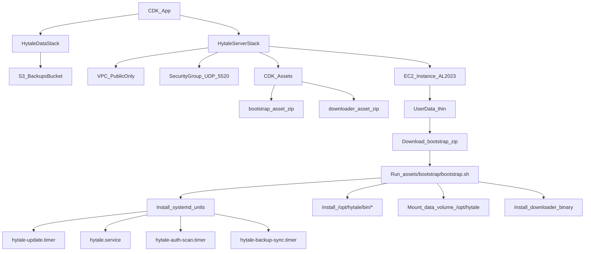

# Refactor notes: CDK modularization + bootstrap split

This repo is intentionally **single-instance** (one EC2 box) and optimized for **SSM-first operations** with **systemd + bash** doing the on-instance work. These notes document the code structure and the refactor approach used to keep it maintainable.

## Architecture (current)

## Bootstrap split (why + layout)

The previous `assets/bootstrap/bootstrap.sh` contained many independent concerns (disk mount, downloader install, server runner, auth scanning, backup sync, restore logic, unit files). It was refactored into a small **installer/orchestrator** plus versioned components.

### Repo layout (bootstrap asset)

- `assets/bootstrap/bootstrap.sh`: installer that:
  - mounts the data volume at `/opt/hytale`
  - writes `/etc/hytale/*.env`
  - installs scripts under `/opt/hytale/bin`
  - installs systemd units under `/etc/systemd/system`
  - enables/starts the services/timers
- `assets/bootstrap/bin/*.sh`: scripts installed to `/opt/hytale/bin/`
- `assets/bootstrap/systemd/*.{service,timer}`: unit files copied to `/etc/systemd/system/`
- `assets/bootstrap/lib/*.sh`: shared helpers sourced by `bootstrap.sh`

### Installed on-instance layout

- **Persistent state**: `/opt/hytale` (on the data EBS volume)
- **Config**: `/etc/hytale/discord.env`, `/etc/hytale/hytale.env`
- **Scripts**: `/opt/hytale/bin/*`
- **Systemd**: `/etc/systemd/system/hytale*.{service,timer}`

## Disk/device naming robustness

Nitro instances can expose EBS volumes as NVMe devices (e.g. `/dev/nvme1n1`) even if the block device mapping uses `/dev/xvdb`.

Bootstrap now selects the data disk using this priority:

- **`HYTALE_DATA_DEVICE`** if set (explicit override)
- `/dev/xvdb` if present (legacy mapping)
- otherwise: choose the **non-root** whole disk matching **`DATA_VOLUME_SIZE_GIB`** (default 30GiB)

Formatting is still guarded by the same safety checks:
- refuses to format when a filesystem/signature is detected unless `FORCE_FORMAT=1` (or `BOOTSTRAP_CONFIRM=1`)

## CDK modularization (goal: composition over implementation)

`lib/hytale-server-stack.ts` is kept as the *composition root* and delegates to small modules under `lib/server/`:

- `lib/server/config.ts`: shared constants + context parsing
- `lib/server/network.ts`: VPC + SG creation
- `lib/server/instance.ts`: instance role + instance definition (including EBS sizes)
- `lib/server/assets.ts`: CDK assets for downloader + bootstrap
- `lib/server/userdata.ts`: user-data wiring (asset bucket/key + env passed to bootstrap)
- `lib/server/discord.ts`: EventBridge + Lambda notifier wiring

This makes future changes (ports, instance sizing, bootstrap env surface, optional features) more localized and safer to review.

## Migration notes

Because the bootstrap logic is run from EC2 user-data on **first boot**, updating bootstrap behavior is easiest by:

- **Destroy/redeploy `HytaleServerStack`** (the recommended path for bootstrap changes), while keeping `HytaleDataStack` intact.

If you must update an existing instance in-place:

- Copy the new `assets/bootstrap/` contents to the instance and run `bootstrap.sh` manually as root.
- Be mindful of the data volume formatting guardrails (don’t set `FORCE_FORMAT` unless you intend to wipe).

